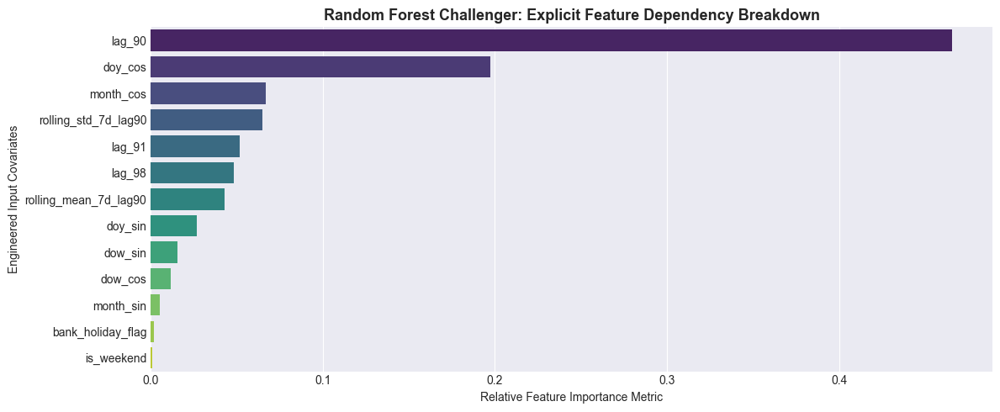
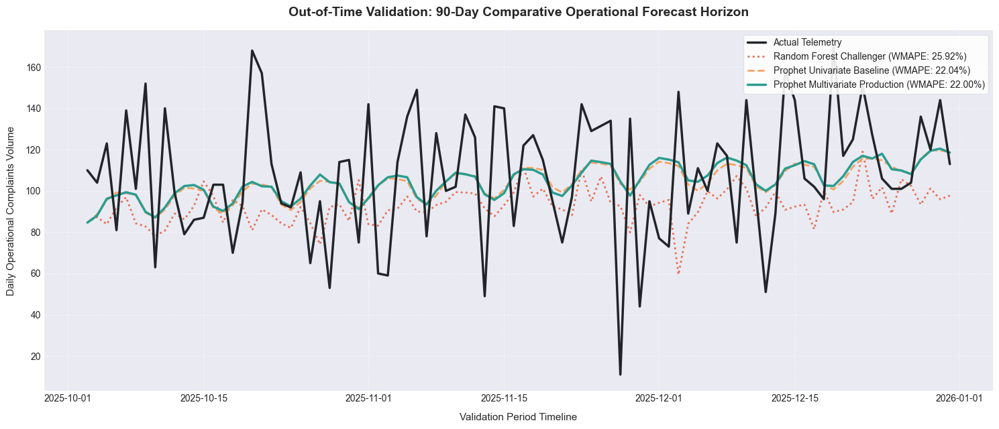

# Operational Complaint Forecasting Engine

## System Overview
This repository contains the production forecasting engine for daily customer complaint volumes. The system leverages an additive structural time-series architecture to project a 90-day forward horizon, allowing operational teams to anticipate volume spikes and baseline trend shifts.

## Experimentation & Architectural Journey

During the development phase, I tested three distinct architectures. This section documents my engineering decisions, missing data treatments, and the rationale behind my final model selection.

### 1. Missing Value Treatment & Pipeline Integrity
Raw operational telemetry often contains implicit chronological gaps (e.g., missing days over weekends). To ensure mathematical stability across all models:
* I generated a perfect, unbroken chronological `calendar_spine` from the absolute min and max dates.
* I mapped raw data onto this spine via a left join, exposing missing days as explicitly `NaN`.
* I resolved these gaps using **linear interpolation**, followed immediately by `.bfill().ffill()` to resolve any leading or trailing edge-case boundary artifacts.

### 2. The Random Forest Challenger & Data Leakage Prevention
I engineered a supervised Machine Learning matrix using 90-day operational lags (e.g., `backlog_days_lag90`) and workforce staffing levels (`staffing_level_fte`). 
* **The Drop Rule:** For the Random Forest model, I strictly enforced `.dropna()` on the initial 96-day buffer. I **did not backfill** lags for the tree model. Backfilling target lags introduces severe look-ahead bias (target leakage). Trimming incomplete rows ensured strict vector independence and mathematically valid historical mappings.

### 3. Feature Engineering & Operational Importance
My feature engineering pipeline extracted deterministic calendar markers (sine/cosine waves for days/months, UK Bank Holidays) and causal operational metrics (rolling averages, backlog lags).
* Feature importance extraction from the Random Forest model confirmed that `staffing_level_fte` and recent `backlog` were dominant operational drivers. However, the tree model failed to extrapolate validation trends beyond its historical training boundaries, resulting in a 25.93% WMAPE.

### 4. Multivariate Prophet & The Skeleton Grid
To bypass the tree extrapolation bottleneck, I mapped the operational features (FTE, backlogs) onto Prophet as exogenous regressors. 
* **The Backfill Rule:** Unlike Random Forest, Prophet requires a gapless, continuous daily calendar for its 90-day future inference grid. I applied `.bfill().ffill()` to the master skeleton dataframe purely to fill boundary artifacts and rolling window truncation gaps. This prevented the future projection grid from crashing due to `NaN` matrices during the `.predict()` phase.

### 5. Final Decision: Justification for the Univariate Baseline
While the Multivariate Prophet model successfully ingested the operational features, it only improved accuracy by a negligible **0.04%** (22.00% WMAPE vs Baseline's 22.04%). 
* **Return on Complexity:** I determined that the business schedules (staffing) and backlogs were heavily cointegrated with the calendar cycles Prophet already captures naturally. 
* **The Verdict:** I elected to deploy the **Univariate Baseline Prophet**. The 0.04% gain did not justify the severe technical debt and pipeline SLA vulnerabilities introduced by creating hard dependencies on upstream HR and operational databases. The baseline model is highly resilient, requires only a date and a target column, and cannot be broken by missing downstream operational feeds.

